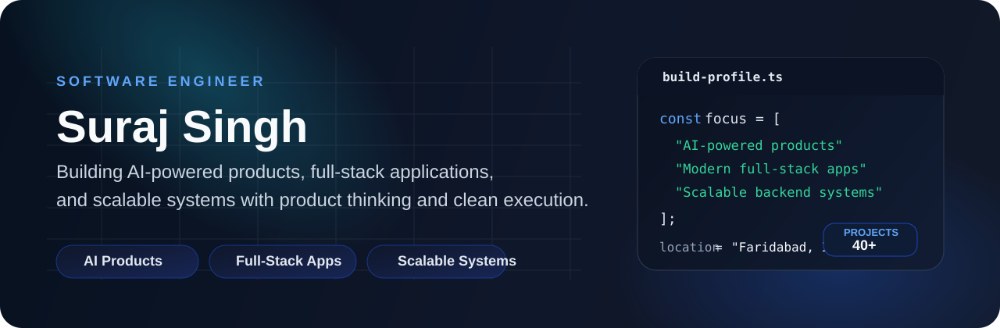

  

  
  
  

  
  
  

## Engineering Profile

I build AI-powered products, modern full-stack applications, and scalable backend systems with a strong focus on product quality, maintainability, and real-world execution. I care about software that feels polished for users and stays clean under the hood as it grows.

<table>
  <tr>
    <td valign="top" width="50%">
      <strong>What I Build</strong>
      <ul>
        <li>AI-driven product experiences</li>
        <li>Full-stack applications with strong UX</li>
        <li>Backend services and automation flows</li>
        <li>Systems designed beyond the prototype stage</li>
      </ul>
    </td>
    <td valign="top" width="50%">
      <strong>How I Approach Engineering</strong>
      <ul>
        <li>Product-first thinking with practical delivery</li>
        <li>Clean architecture and long-term maintainability</li>
        <li>Performance, clarity, and usability as defaults</li>
        <li>Continuous growth in advanced system design</li>
      </ul>
    </td>
  </tr>
</table>

## Core Stack

  
  
  
  
  
  
  

## Current Focus

- Building AI features that are genuinely useful, fast, and reliable.
- Designing systems that can scale without losing clarity.
- Improving backend architecture and delivery quality from idea to launch.

## GitHub Snapshot

  

  
  

## Explore My Work

- Primary GitHub: [github.com/Suraj1812](https://github.com/Suraj1812)
- Project archive: [github.com/Suraj44500](https://github.com/Suraj44500)
- Portfolio: [portfolio-react-self-alpha.vercel.app](https://portfolio-react-self-alpha.vercel.app/)

  Building useful software with strong foundations and ambitious execution.

